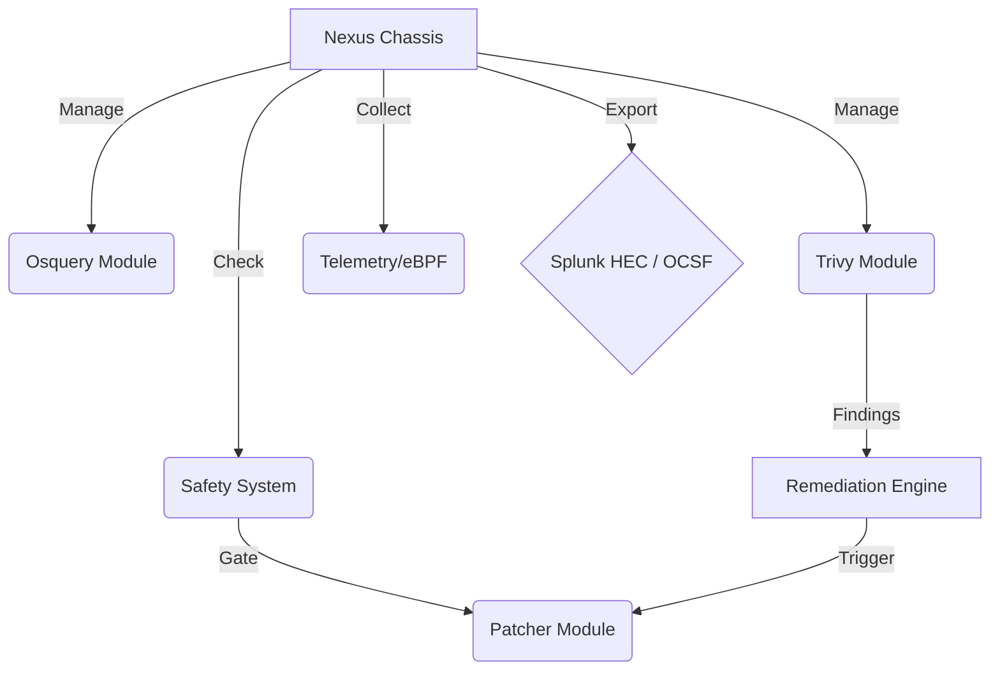

# Nexus Node 🕷️

> **The "Super Agent" for the modern enterprise.**
> A modular, high-performance security agent replacing Splunk Forwarders, Tanium, Qualys, and generic Patch Managers with a single open-architecture binary.


## 🚀 Overview

Nexus Node is designed to break the vendor lock-in of proprietary agents. It embraces **Open Standards** (OCSF, eBPF) and **Best-in-Class Open Source** tools (Osquery, Trivy, Winget) to deliver a Unified Endpoint Management & Security platform.

### Core Capabilities
-   **👁️ Watcher**: Asset Inventory & config monitoring via embedded [Osquery](https://osquery.io).
-   **🏹 Hunter**: Vulnerability scanning via embedded [Trivy](https://trivy.dev) and real-time eBPF telemetry.
-   **🛠️ Doer**: Safe, policy-driven patching using native OS package managers (`winget`, `apt`, `softwareupdate`).
-   **❤️ Healer**: Auto-remediation engine that fixes critical vulnerabilities automatically based on policy.

## ✨ Features

| Feature | Description | Status |
| :--- | :--- | :--- |
| **Unified Agent** | Single binary replacing Splunk Fwd, Tanium, Qualys. | ✅ |
| **Config as Code** | Configure via YAML, Env Vars, or remote URL. | ✅ |
| **Safe Patching** | Wraps `winget`/`apt` with CPU & Time safety checks. | ✅ |
| **Auto-Heal** | Fix critical CVEs automatically based on policy. | ✅ |
| **The Hive** | P2P Update Sharing & LAN Discovery (UDP/HTTP). | ✅ |
| **Zero Trust** | mTLS Authentication & Secure Pipeline Routing. | ✅ |
| **Cloud Native** | K8s DaemonSet, Container Scanning, & Serverless Lite Mode. | ✅ |
| **OCSF Native** | All logs normalized to Open Cybersecurity Schema Framework. | ✅ |
| **eBPF Telemetry** | Real-time kernel tracing (Linux) / Simulated (Windows). | ✅ |
| **eBPF Telemetry** | Real-time kernel tracing (Linux) / Simulated (Windows). | ✅ |

## 🏗️ Architecture

Nexus Node follows a "Chassis" architecture. The core binary is a lightweight orchestrator that manages specialized sub-modules.



## 📥 Installation & Deployment

### Mass Deployment (Enterprise)
For standard deployment, host a `config.yaml` on your internal network (e.g., S3, Sharepoint) and use the installer arguments.

**Windows (PowerShell)**:
```powershell
$Params = @{ ConfigUrl = "https://internal.corp/nexus-config.yaml" }; iex ((New-Object System.Net.WebClient).DownloadString('https://raw.githubusercontent.com/YOUR_USERNAME/nexus-node/main/scripts/install.ps1')) $Params
```

**Linux / macOS**:
```bash
curl -sfL https://raw.githubusercontent.com/YOUR_USERNAME/nexus-node/main/scripts/install.sh | sudo ConfigUrl="https://internal.corp/nexus-config.yaml" bash
```

### Configuration (Environment Variables)
You can override `config.yaml` settings using Environment Variables (useful for Kubernetes/Docker):

-   `NEXUS_AGENT_NAME` -> Overrides agent name.
-   `NEXUS_SPLUNK_URL` -> Overrides Splunk HEC URL.
-   `NEXUS_SPLUNK_TOKEN` -> Overrides Splunk HEC Token.

## ⚡ Usage

1.  **Run Manually**:
    ```bash
    # Windows
    & "C:\Program Files\NexusNode\nexus.exe"
    
    # Linux
    /opt/nexus-node/nexus
    ```
2.  **Logs**: Check functionality.
    -   Startup: `Agent Chassis initialized...`
    -   Dry Run Patching: `Patcher: ListUpdates completed...`
    -   Remediation: `[REMEDIATION] Attempting to fix...`
    
## 🤝 Contributing

We welcome contributions! Please see [CONTRIBUTING.md](CONTRIBUTING.md) for details on how to add new modules (e.g., eBPF for Linux).

## 📄 License

This project is licensed under the MIT License - see the [LICENSE](LICENSE) file for details.
