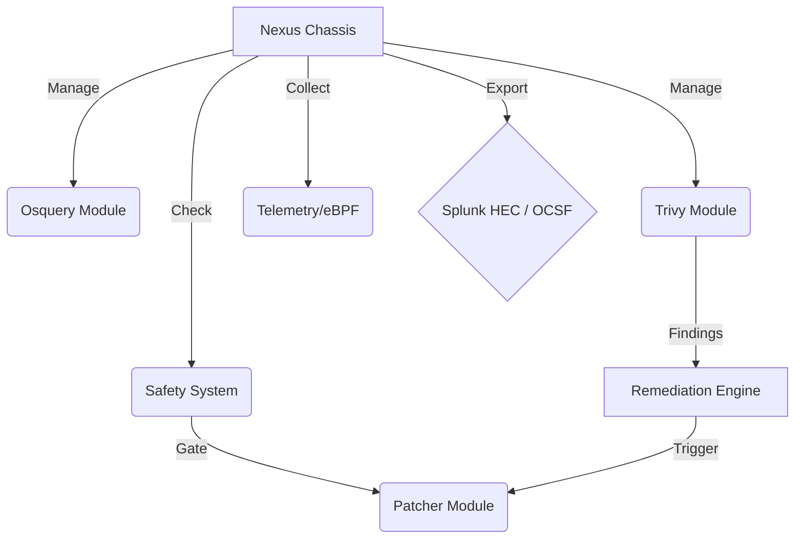

# Nexus Node 🕷️

> **The "Super Agent" for the modern enterprise.**
> A modular, high-performance security agent replacing Splunk Forwarders, Tanium, Qualys, and generic Patch Managers with a single open-architecture binary.


## 🚀 Overview

Nexus Node is designed to break the vendor lock-in of proprietary agents. It embraces **Open Standards** (OCSF, eBPF) and **Best-in-Class Open Source** tools (Osquery, Trivy, Winget) to deliver a Unified Endpoint Management & Security platform.

### Core Capabilities
-   **👁️ Watcher**: Asset Inventory & config monitoring via embedded [Osquery](https://osquery.io).
-   **🏹 Hunter**: Vulnerability scanning via embedded [Trivy](https://trivy.dev) and real-time eBPF telemetry.
-   **🛠️ Doer**: Safe, policy-driven patching using native OS package managers (`winget`, `apt`, `softwareupdate`).
-   **❤️ Healer**: Auto-remediation engine that fixes critical vulnerabilities automatically based on policy.

## 🏗️ Architecture

Nexus Node follows a "Chassis" architecture. The core binary is a lightweight orchestrator that manages specialized sub-modules.



## 🛠️ Installation

### Prerequisites
-   **Go 1.21+** (for building from source)
-   **Osquery** installed or embedded in `./bin`
-   **Trivy** installed or embedded in `./bin`
-   **Winget** (Windows only)

### Build
```bash
go mod tidy
go build -o nexus.exe ./cmd/nexus
```

## ⚡ Usage

1.  **Configure**: Edit `config.yaml`.
    ```yaml
    agent:
      name: "node-01"
    exporter:
      splunk:
        enabled: true
        url: "https://splunk-hec:8088"
    remediation:
      enabled: true
      auto_patch_severity: ["CRITICAL"]
    ```
2.  **Run**:
    ```bash
    ./nexus.exe --config config.yaml
    ```
3.  **Logs**: Check functionality.
    -   Startup: `Agent Chassis initialized...`
    -   Dry Run Patching: `Patcher: ListUpdates completed...`
    -   Remediation: `[REMEDIATION] Attempting to fix...`
    
## 🤝 Contributing

We welcome contributions! Please see [CONTRIBUTING.md](CONTRIBUTING.md) for details on how to add new modules (e.g., eBPF for Linux).

## 📄 License

This project is licensed under the MIT License - see the [LICENSE](LICENSE) file for details.
